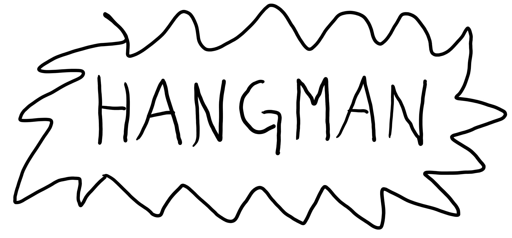

# HANGMAN GAME



## Description

This is my final project for CHEME5500

[Hangman](https://en.wikipedia.org/wiki/Hangman_%28game%29) is a words guessing game for one player. The computer generates a word at random and the user has to suggest letters one by one. Every time the word contains a letter, the computer opens it to the user to see (all of them, if there are a few). Every time the word doesn't contain a letter, the computer gives a penalty point for the user. If there are seven penalty points, the user loses. If there are no hidden letters anymore, the computer looses.

For this Hangman the user has the option to type a word to be guessed by another user. Also in this version instead of a man being hung, you have a man floating with balloons. Each wrong guess makes a balloon pop, and eventually the man will fall to the ground.


## Requirements

* You must have python 2.7 to use this code.
* You must have pygame on your machine. You can [download](https://www.pygame.org/download.shtml) and use pip to install pygame. Make sure to download and install the version compatible with Python 2.7 .

## Usage

To use simply download the folder and then run
```python
python hangman_game.py
```
